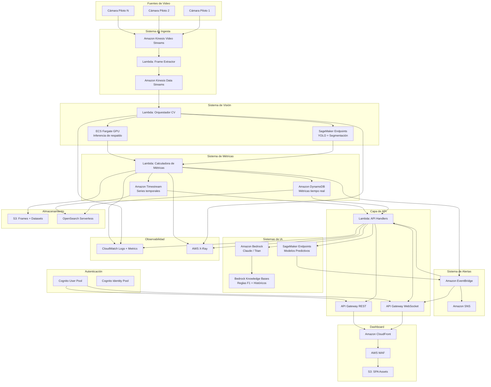
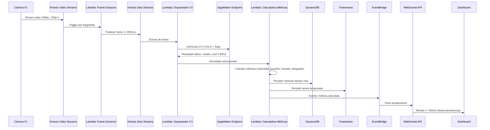
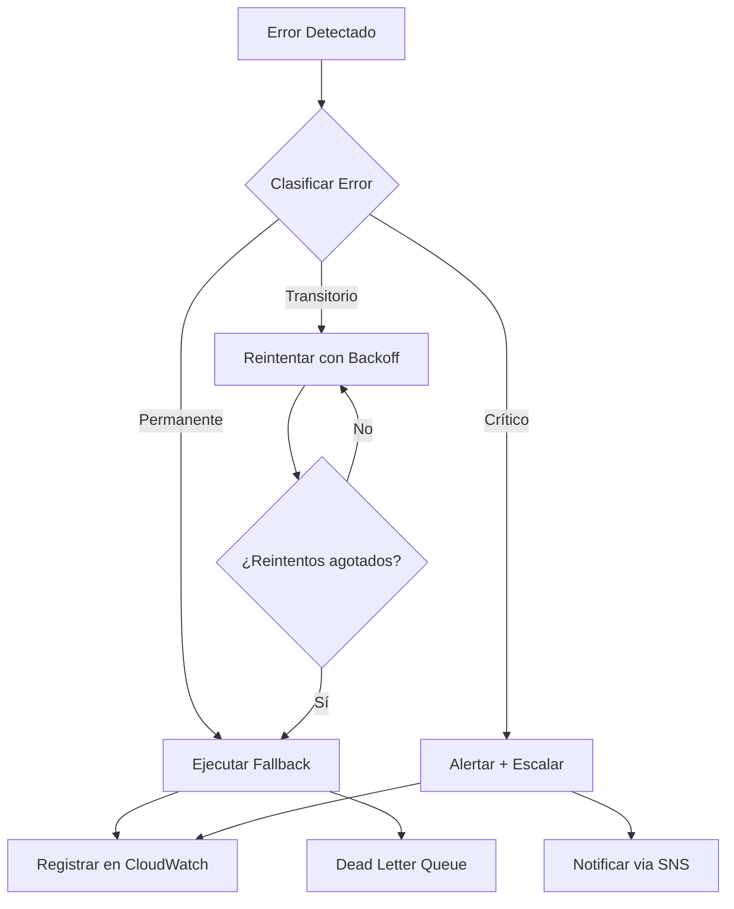

# Documento de Diseño Técnico - ApexVision AI Platform

## Overview

ApexVision AI es una plataforma de análisis de rendimiento en tiempo real para Fórmula 1, construida íntegramente sobre servicios AWS. El sistema ingesta flujos de video de cámaras onboard, aplica modelos de visión por computador para detectar y segmentar objetos, extrae métricas de rendimiento frame a frame, genera insights mediante IA Generativa (Amazon Bedrock), predice estrategias óptimas mediante modelos de ML (SageMaker), y presenta toda la información en un dashboard en tiempo real protegido por autenticación multifactor.

### Decisiones de Diseño Clave

1. **Arquitectura event-driven serverless**: Maximiza escalabilidad y minimiza costos en periodos sin carga.
2. **Pipeline de procesamiento desacoplado**: Cada subsistema opera de forma independiente con colas intermedias, permitiendo escalado individual y tolerancia a fallos parciales.
3. **Dual storage strategy**: DynamoDB para acceso en tiempo real + Timestream para series temporales históricas + OpenSearch para búsqueda avanzada.
4. **WebSocket para push en tiempo real**: Elimina polling y garantiza latencia sub-segundo en actualizaciones al dashboard.
5. **CDK TypeScript como IaC**: Permite type-safety, reutilización de constructos y validaciones de seguridad integradas (cdk-nag).

---

## Architecture

### Diagrama de Arquitectura de Alto Nivel



### Diagrama de Flujo de Procesamiento de Frame



---

## Components and Interfaces

### 1. Sistema de Ingesta (Sistema_Ingestion)

**Responsabilidad**: Capturar flujos de video de hasta 20 cámaras simultáneas y publicar frames individuales en el pipeline de procesamiento.

**Componentes**:
- **Kinesis Video Streams**: Un stream por piloto. Configuración: 720p mínimo, 30fps.
- **Lambda Frame Extractor**: Función disparada por fragmentos de KVS que extrae frames individuales y los publica en Kinesis Data Streams.
- **Kinesis Data Streams**: Stream de frames con particionamiento por `pilotoId`. Shards calculados para soportar 20 pilotos × 30fps = 600 frames/segundo.

**Interfaces**:

```typescript
// Evento de entrada del Frame Extractor
interface KVSFragmentEvent {
  streamName: string;
  fragmentNumber: string;
  producerTimestamp: number;
  serverTimestamp: number;
  pilotoId: string;
}

// Mensaje publicado en KDS
interface FrameMessage {
  frameId: string;           // UUID v4
  pilotoId: string;          // Identificador del piloto
  sessionId: string;         // Identificador de sesión/carrera
  timestamp: number;         // Epoch ms de captura original
  s3Key: string;             // Referencia al frame en S3 (raw)
  resolution: { width: number; height: number };
  sequenceNumber: number;    // Secuencia dentro del stream
  streamName: string;
}
```

**Configuración de resiliencia**:
- Reconexión con backoff exponencial: base 1s, factor 2, máximo 3 intentos.
- Después de 3 intentos fallidos: marcar flujo como inactivo, notificar operaciones.
- Métrica de pérdida de frames: alarma si > 0.1% en ventana de 60s.

### 2. Sistema de Visión (Sistema_Vision)

**Responsabilidad**: Ejecutar detección de objetos y segmentación sobre cada frame dentro del SLA de 500ms.

**Componentes**:
- **SageMaker Real-Time Endpoints**: Modelos YOLO v8 para detección + modelo de segmentación semántica. Auto-scaling configurado (min: 2, max: 10 instancias ml.g5.xlarge).
- **ECS Fargate (GPU)**: Capacidad de respaldo para picos de carga.
- **Lambda Orquestador CV**: Coordina invocación al endpoint, gestiona timeouts y fallback a ECS.

**Interfaces**:

```typescript
// Input al modelo de inferencia
interface InferenceRequest {
  frameId: string;
  pilotoId: string;
  imagePayload: Buffer;      // Frame codificado en JPEG
  timestamp: number;
  modelVersion: string;
}

// Output del modelo de inferencia
interface InferenceResult {
  frameId: string;
  pilotoId: string;
  timestamp: number;
  processingTimeMs: number;
  detections: Detection[];
  segmentation: SegmentationMask;
}

interface Detection {
  classId: string;           // 'vehiculo_propio' | 'vehiculo_cercano' | 'limite_pista' | 'sector'
  confidence: number;        // 0.0 - 1.0 (filtrado: ≥ 0.80)
  boundingBox: BoundingBox;
  attributes?: Record<string, string>;
}

interface BoundingBox {
  x: number;      // Coordenada X superior izquierda (normalizada 0-1)
  y: number;      // Coordenada Y superior izquierda (normalizada 0-1)
  width: number;  // Ancho (normalizado 0-1)
  height: number; // Alto (normalizado 0-1)
}

interface SegmentationMask {
  width: number;
  height: number;
  classes: string[];           // Clases presentes en la máscara
  maskData: Uint8Array;        // Máscara codificada (cada píxel = índice de clase)
}
```

**Reglas de descarte**:
- Frame descartado si procesamiento > 500ms o error de inferencia.
- Alerta de degradación si > 10 frames consecutivos descartados.

### 3. Sistema de Métricas (Sistema_Metricas)

**Responsabilidad**: Calcular métricas de rendimiento a partir de resultados de visión y persistirlas con trazabilidad temporal.

**Componentes**:
- **Lambda Calculadora de Métricas**: Función que recibe `InferenceResult` y calcula las 5 métricas definidas.
- **Módulo de Validación**: Verifica rangos físicos configurables por circuito.
- **Writer DynamoDB**: Persistencia de métricas en tiempo real.
- **Writer Timestream**: Persistencia de series temporales históricas.

**Interfaces**:

```typescript
interface MetricasFrame {
  frameId: string;
  pilotoId: string;
  sessionId: string;
  timestampCaptura: number;   // Timestamp original del frame
  timestampCalculo: number;   // Timestamp del cálculo
  circuitoId: string;
  vueltaNumero: number;
  metricas: {
    velocidadAparente: number;      // km/h, resolución 0.1
    posicionLineaCarrera: number;   // metros desviación lateral, resolución 0.01
    intensidadFrenado: number;      // porcentaje 0-100
    anguloDirection: number;        // grados -180 a +180, resolución 0.1
    desgasteNeumaticos: number;     // porcentaje degradación 0-100
  };
  desviacionLineaOptima: number;    // metros respecto a línea óptima
  valido: boolean;                  // false si alguna métrica fuera de rango
  metricasAnomelas?: string[];      // Lista de métricas fuera de rango
}

interface ConfiguracionCircuito {
  circuitoId: string;
  nombre: string;
  longitudMetros: number;
  sectores: Sector[];
  lineaOptima: PuntoLineaOptima[];  // ≥ 10 puntos por curva
  rangosValidos: RangosMetricas;
}

interface RangosMetricas {
  velocidadAparente: { min: number; max: number };    // ej: 0 - 370 km/h
  posicionLineaCarrera: { min: number; max: number }; // ej: -15 - 15 metros
  intensidadFrenado: { min: number; max: number };    // 0 - 100
  anguloDirection: { min: number; max: number };      // -180 - +180
  desgasteNeumaticos: { min: number; max: number };   // 0 - 100
}

// Resultado de validación
interface ValidacionMetrica {
  metrica: string;
  valor: number;
  rangoMin: number;
  rangoMax: number;
  esValido: boolean;
}
```

**Algoritmo de cálculo de velocidad aparente**:
1. Comparar posición del vehículo entre frame actual y frame anterior (basado en bounding box y calibración de cámara).
2. Aplicar factor de conversión píxel/metro según sector del circuito.
3. Calcular desplazamiento / intervalo temporal entre frames.
4. Aplicar filtro de media móvil (ventana de 5 frames) para suavizado.

**Algoritmo de desviación de línea de carrera**:
1. Obtener posición del vehículo en coordenadas de pista (transformación homográfica).
2. Interpolar punto más cercano en la línea óptima precargada.
3. Calcular distancia euclidiana perpendicular a la tangente de la línea óptima.

### 4. Sistema de IA Generativa (Sistema_GenAI)

**Responsabilidad**: Generar insights en lenguaje natural, recomendaciones estratégicas y resúmenes utilizando Amazon Bedrock.

**Componentes**:
- **Lambda GenAI Handler**: Orquesta invocaciones a Bedrock con contexto apropiado.
- **Bedrock Knowledge Base**: Indexa reglas de F1, datos históricos y configuraciones de circuitos.
- **Prompt Templates**: Plantillas parametrizadas para cada tipo de insight.

**Interfaces**:

```typescript
interface InsightRequest {
  pilotoId: string;
  sessionId: string;
  intervaloSegundos: number;     // Normalmente 5s
  metricas: MetricasFrame[];     // Métricas del intervalo
  contextoCarrera: ContextoCarrera;
}

interface ContextoCarrera {
  vueltaActual: number;
  vueltasTotales: number;
  posicionPiloto: number;
  pilotoAdelante?: PilotoResumen;
  pilotoDetras?: PilotoResumen;
  compuestoNeumatico: string;
  vueltasConCompuesto: number;
}

interface InsightResponse {
  insightId: string;
  pilotoId: string;
  timestamp: number;
  tipo: 'rendimiento' | 'estrategia' | 'resumen';
  texto: string;                    // Insight en lenguaje natural
  confianza: number;                // 0.0 - 1.0
  contextosUtilizados: string[];    // Referencias a Knowledge Base
  tiempoGeneracionMs: number;
}

interface RecomendacionEstrategia {
  insightId: string;
  pilotoId: string;
  timestamp: number;
  ventanaTemporal: { inicioSegundos: number; finSegundos: number };
  nivelRiesgo: 'bajo' | 'medio' | 'alto';
  texto: string;
  fundamentacion: string[];          // Referencias del Knowledge Base
}

interface ResumenStint {
  sessionId: string;
  pilotoId: string;
  stintNumero: number;
  ritmoPromedio: number;             // Segundos por vuelta
  variacionPorVuelta: number[];      // Variación respecto a media
  tendenciasDegradacion: string[];
  eventosDesviacion: EventoDesviacion[];
  recomendaciones: string[];
}
```

### 5. Sistema de Predicción (Sistema_Prediccion)

**Responsabilidad**: Generar predicciones de estrategia, detectar anomalías y identificar ventanas de adelantamiento.

**Componentes**:
- **SageMaker Endpoints (Predicción)**: Modelos de series temporales (DeepAR) y clasificación para anomalías.
- **Lambda Predicción Handler**: Orquesta ciclos de predicción cada 15-30 segundos.
- **Módulo de Detección de Anomalías**: Calcula desviaciones estándar sobre ventana de 10 vueltas.

**Interfaces**:

```typescript
interface PrediccionPitStop {
  pilotoId: string;
  sessionId: string;
  timestamp: number;
  ventanaOptima: { vueltaInicio: number; vueltaFin: number };
  confianza: number;                // 0.0 - 1.0
  factores: string[];               // Factores que influyen
}

interface AnomaliaRendimiento {
  anomaliaId: string;
  pilotoId: string;
  sessionId: string;
  timestamp: number;
  clasificacion: 'subviraje' | 'sobreviraje' | 'fatiga' | 'degradacion_mecanica';
  desviacionSigma: number;          // Desviaciones estándar (> 2.0)
  metricaAfectada: string;
  valorObservado: number;
  valorEsperado: number;
  ventanaVueltas: number[];         // Últimas 10 vueltas usadas como referencia
}

interface VentanaAdelantamiento {
  ventanaId: string;
  pilotoAtacante: string;
  pilotoDefensor: string;
  sessionId: string;
  timestamp: number;
  sectorTipo: 'recta' | 'curva_lenta' | 'curva_rapida';
  diferenciaSegundosSector: number; // ≥ 0.3s
  diferenciDesgaste: number;        // Porcentaje
  probabilidad: number;             // 0.0 - 1.0
  ventanaTemporalSegundos: { inicio: number; fin: number };
}

// Algoritmo de detección de anomalías
interface ParametrosAnomalias {
  ventanaVueltas: number;           // 10 vueltas
  umbralSigma: number;             // 2.0 desviaciones estándar
  metricasMonitorizadas: string[];
}
```

**Algoritmo de detección de anomalías**:
1. Calcular media y desviación estándar de cada métrica sobre las últimas 10 vueltas.
2. Para el frame actual, calcular Z-score: `z = (valor_actual - media) / desviacion_estandar`.
3. Si |z| > 2.0: clasificar anomalía según la métrica y dirección de la desviación.
4. Clasificación: subviraje (ángulo + posición lateral), sobreviraje (ángulo opuesto + velocidad baja en curva), fatiga (degradación progresiva de tiempos), degradación_mecánica (cambio abrupto en múltiples métricas).

### 6. Sistema de Alertas (Sistema_Alertas)

**Responsabilidad**: Clasificar, agrupar y distribuir alertas en tiempo real mediante EventBridge.

**Interfaces**:

```typescript
interface Alerta {
  alertaId: string;
  tipo: string;                     // Tipo de alerta
  severidad: 'critica' | 'alta' | 'media' | 'informativa';
  pilotoId: string;
  sessionId: string;
  timestamp: number;
  payload: Record<string, unknown>;
  destinatarios: string[];          // Roles o usuarios específicos
  ttlEntrega: number;               // ms máximo para entrega según severidad
}

interface AlertaAgrupada {
  alertaId: string;
  tipo: string;
  pilotoId: string;
  totalOcurrencias: number;
  timestampPrimera: number;
  timestampUltima: number;
  severidad: 'critica' | 'alta' | 'media' | 'informativa';
}

// Regla de agrupación: > 10 alertas del mismo tipo en 60s para mismo piloto
interface ReglaAgrupacion {
  umbralAlertas: number;            // 10
  ventanaSegundos: number;          // 60
  claveAgrupacion: string[];        // ['tipo', 'pilotoId']
}

// SLA de entrega por severidad
const SLA_ENTREGA_MS: Record<string, number> = {
  critica: 500,
  alta: 500,
  media: 2000,
  informativa: 5000,
};
```

### 7. Sistema de Autenticación (Sistema_Auth)

**Responsabilidad**: Gestionar autenticación con MFA y autorización basada en 4 roles.

**Interfaces**:

```typescript
interface UsuarioAuth {
  userId: string;
  email: string;
  rol: 'admin' | 'ingeniero_pista' | 'analista' | 'viewer';
  mfaObligatorio: boolean;          // true para admin e ingeniero_pista
  pilotosAsignados?: string[];      // Para ingeniero_pista
}

interface TokenClaims {
  sub: string;                      // User ID
  email: string;
  'custom:rol': string;
  'custom:permisos': string[];
  exp: number;                      // Expiración: 15 min max para access token
  iat: number;
}

// Matriz de permisos por rol
interface PermisosRol {
  rol: string;
  permisos: Permiso[];
}

type Permiso =
  | 'dashboard:read'
  | 'metricas:realtime'
  | 'metricas:historicas'
  | 'estrategia:read'
  | 'alertas:read'
  | 'alertas:acknowledge'
  | 'reportes:generar'
  | 'reportes:exportar'
  | 'usuarios:gestionar'
  | 'config:modificar';

const PERMISOS_POR_ROL: Record<string, Permiso[]> = {
  admin: [
    'dashboard:read', 'metricas:realtime', 'metricas:historicas',
    'estrategia:read', 'alertas:read', 'alertas:acknowledge',
    'reportes:generar', 'reportes:exportar', 'usuarios:gestionar', 'config:modificar'
  ],
  ingeniero_pista: [
    'dashboard:read', 'metricas:realtime', 'estrategia:read',
    'alertas:read', 'alertas:acknowledge'
  ],
  analista: [
    'dashboard:read', 'metricas:historicas', 'reportes:generar', 'reportes:exportar'
  ],
  viewer: ['dashboard:read']
};
```

### 8. Sistema de Dashboard (Sistema_Dashboard)

**Responsabilidad**: Presentar información en tiempo real mediante SPA con conexión WebSocket.

**Tecnología**: React SPA servida desde S3 + CloudFront, protegida por WAF.

**Interfaces WebSocket**:

```typescript
// Mensaje WebSocket: actualización de métrica
interface WsMetricaUpdate {
  action: 'metrica_update';
  pilotoId: string;
  timestamp: number;
  metricas: Partial<MetricasFrame['metricas']>;
}

// Mensaje WebSocket: alerta
interface WsAlerta {
  action: 'alerta';
  alerta: Alerta | AlertaAgrupada;
}

// Mensaje WebSocket: insight GenAI
interface WsInsight {
  action: 'insight';
  insight: InsightResponse | RecomendacionEstrategia;
}

// Mensaje WebSocket: predicción
interface WsPrediccion {
  action: 'prediccion';
  prediccion: PrediccionPitStop | VentanaAdelantamiento;
}

// Estado de conexión
interface WebSocketState {
  connected: boolean;
  intentosReconexion: number;       // Max 5
  ultimaActualizacion: number;      // Timestamp del último mensaje
  datosObsoletos: Set<string>;      // pilotoIds sin update > 10s
}
```

---

## Data Models

### DynamoDB - Métricas en Tiempo Real

**Tabla: `apexvision-metrics-realtime`**

| Atributo | Tipo | Descripción |
|----------|------|-------------|
| PK | String | `PILOT#{pilotoId}` |
| SK | String | `FRAME#{timestamp}#{frameId}` |
| sessionId | String | ID de sesión/carrera |
| circuitoId | String | ID del circuito |
| vueltaNumero | Number | Número de vuelta |
| velocidadAparente | Number | km/h |
| posicionLineaCarrera | Number | metros desviación |
| intensidadFrenado | Number | porcentaje |
| anguloDirection | Number | grados |
| desgasteNeumaticos | Number | porcentaje |
| desviacionLineaOptima | Number | metros |
| valido | Boolean | Validez del dato |
| timestampCaptura | Number | Epoch ms original |
| ttl | Number | Epoch s (expiración 24h) |

**GSI-1**: `sessionId-timestamp-index` para consultas por sesión.

### DynamoDB - Sesiones y Configuración

**Tabla: `apexvision-sessions`**

| Atributo | Tipo | Descripción |
|----------|------|-------------|
| PK | String | `SESSION#{sessionId}` |
| SK | String | `META` o `PILOT#{pilotoId}` |
| circuitoId | String | ID del circuito |
| fechaInicio | String | ISO 8601 |
| estado | String | `activa` / `finalizada` |
| pilotos | List | Lista de pilotos participantes |

### Timestream - Series Temporales

**Base de datos**: `apexvision-telemetry`
**Tabla**: `metrics`

| Dimensión | Tipo | Descripción |
|-----------|------|-------------|
| piloto_id | VARCHAR | Identificador del piloto |
| session_id | VARCHAR | ID de sesión |
| circuito_id | VARCHAR | ID del circuito |
| metric_name | VARCHAR | Nombre de la métrica |

| Medida | Tipo | Descripción |
|--------|------|-------------|
| value | DOUBLE | Valor de la métrica |
| vuelta | BIGINT | Número de vuelta |
| valido | BOOLEAN | Validez del dato |

**Retención**: Memoria = 24 horas, Magnético = 365-2555 días (configurable).

### OpenSearch Serverless - Índices

**Colección**: `apexvision-analytics`

```json
{
  "mappings": {
    "properties": {
      "pilotoId": { "type": "keyword" },
      "circuitoId": { "type": "keyword" },
      "sessionId": { "type": "keyword" },
      "timestamp": { "type": "date" },
      "metricName": { "type": "keyword" },
      "value": { "type": "float" },
      "vuelta": { "type": "integer" },
      "insight_embedding": { "type": "knn_vector", "dimension": 1536 }
    }
  }
}
```

### S3 - Estructura de Buckets

```
apexvision-data-{env}/
├── raw-frames/{sessionId}/{pilotoId}/{timestamp}.jpg
├── processed-frames/{sessionId}/{pilotoId}/{timestamp}_annotated.jpg
├── datasets/
│   ├── training/{modelVersion}/
│   └── validation/{modelVersion}/
├── exports/{userId}/{reportId}/
└── config/
    └── circuitos/{circuitoId}.json
```

**Políticas de ciclo de vida**:
- 30 días sin acceso → Intelligent-Tiering
- 90 días sin acceso → Glacier

---

## Correctness Properties

*Una propiedad es una característica o comportamiento que debe mantenerse verdadero en todas las ejecuciones válidas de un sistema — esencialmente, una declaración formal sobre lo que el sistema debe hacer. Las propiedades sirven como puente entre especificaciones legibles por humanos y garantías de correctitud verificables por máquinas.*

### Property 1: Máquina de estados de reconexión con backoff exponencial

*Para cualquier* flujo de video y cualquier secuencia de desconexiones, los intervalos de reintento deben seguir la fórmula `intervalo = base × factor^intento` (base=1s, factor=2), ejecutando exactamente 3 reintentos. Si los 3 reintentos fallan, el flujo debe transicionar al estado 'inactivo' y no se deben intentar más reconexiones automáticas.

**Validates: Requirements 1.4, 1.6**

### Property 2: Filtrado de detecciones por umbral de confianza

*Para cualquier* conjunto de detecciones producidas por el modelo de visión con confianzas en el rango [0.0, 1.0], el resultado filtrado debe contener únicamente aquellas detecciones cuya confianza sea ≥ 0.80, y ninguna detección con confianza < 0.80 debe aparecer en el resultado final.

**Validates: Requirements 2.1**

### Property 3: Estructura completa del resultado de inferencia

*Para cualquier* resultado de inferencia válido, la estructura debe contener: frameId no vacío, pilotoId no vacío, timestamp > 0, y cada detección debe tener classId válido, confianza en [0.80, 1.0], y bounding box con coordenadas normalizadas en [0.0, 1.0] donde x + width ≤ 1.0 y y + height ≤ 1.0.

**Validates: Requirements 2.2**

### Property 4: Alerta de degradación por frames consecutivos descartados

*Para cualquier* secuencia de resultados de procesamiento de frames, se debe generar una alerta de degradación si y solo si más de 10 frames consecutivos son descartados. Secuencias con 10 o menos descartes consecutivos no deben generar alerta.

**Validates: Requirements 2.5**

### Property 5: Cálculo de métricas con precisión y trazabilidad

*Para cualquier* resultado de inferencia válido y configuración de circuito, las métricas calculadas deben tener: velocidad aparente con resolución de 0.1 km/h, posición en línea de carrera con resolución de 0.01 m, intensidad de frenado en rango [0, 100], ángulo de dirección en rango [-180, +180] con resolución 0.1°, desgaste en rango [0, 100], y cada registro debe incluir el frameId de origen y el timestamp de captura original.

**Validates: Requirements 3.1, 3.7**

### Property 6: Cálculo de desviación respecto a línea óptima

*Para cualquier* posición de vehículo en coordenadas de pista y cualquier configuración de línea óptima con al menos 10 puntos por curva, la desviación calculada debe ser la distancia perpendicular al punto más cercano de la línea óptima, y el resultado debe ser ≥ 0 con resolución de 0.01 metros.

**Validates: Requirements 3.3**

### Property 7: Validación de rangos físicos de métricas

*Para cualquier* valor de métrica calculado y cualquier configuración de rangos válidos del circuito, si el valor está fuera del rango [min, max] definido para esa métrica, el registro debe marcarse como `valido: false`, la métrica debe aparecer en `metricasAnomelas`, y el valor no debe incluirse en promedios de rendimiento.

**Validates: Requirements 3.4**

### Property 8: Detección de anomalías por Z-score

*Para cualquier* secuencia de valores de una métrica en las últimas 10 vueltas y un valor actual, si el Z-score absoluto `|valor_actual - media| / desviación_estándar` es mayor que 2.0, el sistema debe generar una anomalía con clasificación correcta (subviraje, sobreviraje, fatiga, degradación_mecánica). Si el Z-score es ≤ 2.0, no se debe generar anomalía.

**Validates: Requirements 5.3**

### Property 9: Identificación de ventanas de adelantamiento

*Para cualquier* par de pilotos con métricas de velocidad relativa, desgaste de neumáticos y tipo de sector, una ventana de adelantamiento debe identificarse si y solo si la diferencia de tiempo por sector es ≥ 0.3 segundos. La ventana debe incluir probabilidad en [0.0, 1.0] y tipo de sector correcto.

**Validates: Requirements 5.4**

### Property 10: Reducción de confianza por datos incompletos

*Para cualquier* predicción donde el ratio de frames procesados respecto al total del intervalo es inferior al 70%, el nivel de confianza asignado debe ser < 0.5. Si el ratio es ≥ 70%, la confianza no debe reducirse artificialmente por este factor.

**Validates: Requirements 5.5**

### Property 11: Detección de datos obsoletos

*Para cualquier* métrica de un piloto en el dashboard, si la diferencia entre el timestamp actual y el timestamp de la última actualización es > 10 segundos, la métrica debe ser marcada como obsoleta. Si la diferencia es ≤ 10 segundos, no debe marcarse como obsoleta.

**Validates: Requirements 6.8**

### Property 12: Autorización basada en roles (RBAC)

*Para cualquier* combinación de (rol_usuario, recurso_solicitado), el sistema debe conceder acceso si y solo si el permiso requerido para ese recurso está incluido en el conjunto de permisos definido para ese rol en la matriz PERMISOS_POR_ROL. Ningún rol debe obtener acceso a permisos no asignados en la matriz.

**Validates: Requirements 7.3, 7.4, 7.5, 7.6**

### Property 13: Rate limiting de autenticación

*Para cualquier* secuencia de intentos de autenticación, si se producen N fallos consecutivos dentro de una ventana temporal T, la cuenta debe bloquearse por un periodo D. Específicamente: (N=5, T=10min, D=30min) para autenticación principal, y (N=3, T=sesión, D=15min) para verificación MFA.

**Validates: Requirements 7.10, 7.11**

### Property 14: Clasificación de severidad de alertas y SLA de entrega

*Para cualquier* alerta generada, debe asignarse exactamente una severidad (crítica, alta, media, informativa), y el TTL de entrega máximo debe ser: 500ms para crítica/alta, 2000ms para media, 5000ms para informativa. Una alerta de pit stop inminente (< 3 vueltas) debe clasificarse siempre como severidad 'alta'.

**Validates: Requirements 9.2, 9.3**

### Property 15: Agrupación de alertas por umbral

*Para cualquier* flujo de alertas del mismo tipo para el mismo piloto, si se reciben más de 10 alertas en un período de 60 segundos, deben consolidarse en un único evento agrupado que contenga: tipo, pilotoId, total de ocurrencias, timestamp de la primera y última. Si se reciben 10 o menos, cada alerta se entrega individualmente.

**Validates: Requirements 9.5**

### Property 16: Detección de wildcards en políticas IAM

*Para cualquier* documento de política IAM, la validación debe detectar correctamente la presencia de wildcards (*) en campos de acciones o recursos. Si se detecta wildcard, la política debe ser rechazada. Si no contiene wildcards y los permisos son específicos al servicio, la política debe ser aprobada.

**Validates: Requirements 10.5**

### Property 17: Bloqueo de IP por intentos fallidos

*Para cualquier* IP que genera 3 intentos de autenticación fallidos consecutivos en un período de 5 minutos, la IP debe bloquearse durante 15 minutos. Si los fallos están separados por más de 5 minutos, o no son consecutivos (hay un éxito intermedio), no debe producirse bloqueo.

**Validates: Requirements 10.7**

### Property 18: Formato estructurado de logs

*Para cualquier* entrada de log generada por cualquier componente del sistema, el formato debe ser JSON válido conteniendo los campos obligatorios: timestamp (ISO 8601), nivel (debug/info/warn/error), servicio (identificador del componente), traceId (correlación distribuida) y mensaje. El tamaño total no debe exceder 256 KB.

**Validates: Requirements 11.1**

---

## Error Handling

### Estrategia General de Errores

El sistema implementa una estrategia de errores en capas:



### Errores por Subsistema

| Subsistema | Error | Estrategia | Reintentos | Fallback |
|------------|-------|------------|------------|----------|
| Ingestion | Desconexión cámara | Backoff exponencial (1s, 2s, 4s) | 3 | Marcar inactivo, notificar ops |
| Vision | Timeout inferencia > 500ms | Descartar frame | N/A | Alerta si > 10 consecutivos |
| Vision | Error de modelo | Log + skip | N/A | Continuar con siguiente frame |
| Métricas | Valor fuera de rango | Marcar anómalo | N/A | Excluir de promedios |
| Métricas | Fallo escritura Timestream | Retry 5s interval | 3 | DLQ + notificar |
| GenAI | Timeout Bedrock > 5s | Retry en ciclos | 3 | Preservar último insight válido |
| Predicción | Timeout > 10s | Descartar ciclo | N/A | Mantener última predicción |
| Predicción | Datos incompletos (< 70%) | Confianza reducida | N/A | Notificar dashboard |
| Dashboard | Desconexión WebSocket | Reconexión automática < 3s | 5 | Mostrar estado desconectado |
| Auth | 5 fallos autenticación / 10 min | Bloqueo cuenta 30 min | N/A | Notificar usuario |
| Auth | Refresh token expirado | Redirect a login | N/A | Preservar datos no guardados |
| Alertas | Fallo entrega | Retry 2s interval | 3 | Escalar a Admin |
| Seguridad | Fallo rotación KMS/Secrets | Alerta crítica | N/A | Mantener clave vigente |
| IaC | Fallo despliegue | Rollback automático | N/A | Notificar via pipeline |

### Patrones de Resiliencia

1. **Circuit Breaker**: Implementado en llamadas a SageMaker y Bedrock. Se abre tras 5 fallos en 30 segundos, se cierra tras 60 segundos.
2. **Bulkhead**: Cada piloto procesado en isolation — el fallo en un stream no afecta a otros.
3. **Dead Letter Queue**: Mensajes que no pueden procesarse se envían a SQS DLQ para reprocesamiento manual.
4. **Graceful Degradation**: Si un subsistema falla, los demás continúan operando con datos parciales.

---

## Testing Strategy

### Enfoque Dual de Testing

La estrategia combina tests unitarios (ejemplos específicos) con tests de propiedades (verificación universal):

#### Tests Unitarios / de Ejemplo
- Verificar comportamientos específicos con inputs concretos
- Cubrir edge cases y condiciones de error
- Tests de integración contra servicios AWS (con mocks para unit, reales para integration)
- Tests de componentes UI del dashboard

#### Tests Basados en Propiedades (Property-Based Testing)

**Biblioteca**: [fast-check](https://github.com/dubzzz/fast-check) (TypeScript)

**Configuración**:
- Mínimo 100 iteraciones por propiedad
- Cada test referencia la propiedad del documento de diseño

**Formato de tag**:
```typescript
// Feature: apexvision-ai-platform, Property {N}: {texto de la propiedad}
```

**Propiedades implementadas como PBT** (18 propiedades):

| # | Propiedad | Módulo bajo test |
|---|-----------|-----------------|
| 1 | Backoff exponencial + estado inactivo | `src/ingestion/reconnection.ts` |
| 2 | Filtrado por confianza ≥ 80% | `src/vision/confidence-filter.ts` |
| 3 | Estructura resultado de inferencia | `src/vision/inference-result.ts` |
| 4 | Alerta por 10+ frames descartados | `src/vision/discard-monitor.ts` |
| 5 | Métricas con precisión + trazabilidad | `src/metrics/calculator.ts` |
| 6 | Desviación línea óptima | `src/metrics/line-deviation.ts` |
| 7 | Validación de rangos físicos | `src/metrics/range-validator.ts` |
| 8 | Detección anomalías Z-score | `src/prediction/anomaly-detector.ts` |
| 9 | Ventanas de adelantamiento | `src/prediction/overtaking-windows.ts` |
| 10 | Confianza reducida datos incompletos | `src/prediction/confidence-reducer.ts` |
| 11 | Datos obsoletos | `src/dashboard/staleness-detector.ts` |
| 12 | RBAC autorización | `src/auth/rbac-authorizer.ts` |
| 13 | Rate limiting autenticación | `src/auth/rate-limiter.ts` |
| 14 | Clasificación severidad + SLA | `src/alerts/severity-classifier.ts` |
| 15 | Agrupación de alertas | `src/alerts/alert-grouper.ts` |
| 16 | Detección wildcards IAM | `src/security/iam-validator.ts` |
| 17 | Bloqueo de IP | `src/security/ip-blocker.ts` |
| 18 | Formato estructurado de logs | `src/observability/log-formatter.ts` |

### Tests de Integración

- Pipeline end-to-end: frame → métricas → dashboard (con LocalStack o mocks de AWS SDK)
- Conexión WebSocket: conectar, recibir mensajes, reconexión
- Autenticación Cognito: flujo completo de login con MFA
- Persistencia: escritura y lectura DynamoDB + Timestream

### Tests de Infraestructura (CDK)

- **Snapshot tests**: `cdk synth` comparado contra baseline
- **CDK Assertions**: Verificar recursos, propiedades y dependencias
- **cdk-nag**: Validaciones de seguridad automatizadas
- **Tests de síntesis**: Cada stack sintetiza sin errores

### Tests de Rendimiento

- Latencia de procesamiento de frame < 500ms (SageMaker endpoint)
- Latencia end-to-end < 2s (p99)
- WebSocket: 1000 conexiones concurrentes con latencia ≤ 100ms (p95)
- Ingesta: 20 streams simultáneos a 30fps sin pérdida > 0.1%

### Estructura de Tests

```
tests/
├── unit/
│   ├── ingestion/
│   ├── vision/
│   ├── metrics/
│   ├── prediction/
│   ├── alerts/
│   ├── auth/
│   ├── security/
│   └── observability/
├── property/                    # Property-based tests (fast-check)
│   ├── ingestion.property.ts
│   ├── vision.property.ts
│   ├── metrics.property.ts
│   ├── prediction.property.ts
│   ├── alerts.property.ts
│   ├── auth.property.ts
│   ├── security.property.ts
│   └── observability.property.ts
├── integration/
│   ├── pipeline.integration.ts
│   ├── websocket.integration.ts
│   ├── auth.integration.ts
│   └── storage.integration.ts
├── infrastructure/
│   ├── snapshot/
│   └── assertions/
└── performance/
    ├── latency.perf.ts
    └── load.perf.ts
```
