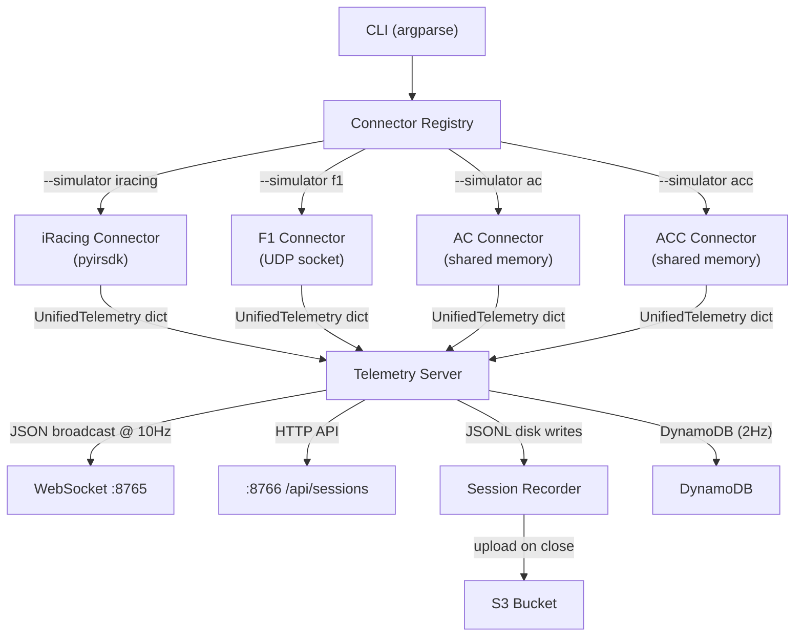
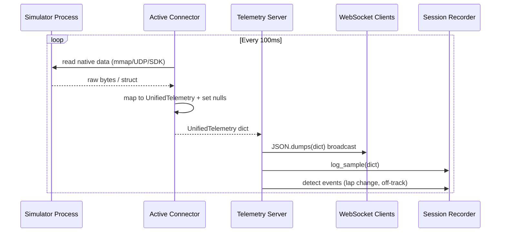

# Design Document: Multi-Simulator Telemetry

## Overview

This design extends the existing `iracing_live.py` monolithic telemetry server into a plugin-based connector architecture. Each racing simulator (iRacing, F1 2024/2025, Assetto Corsa, ACC) gets its own connector module that reads native telemetry and translates it to a unified JSON schema. The Telemetry Server remains agnostic to the data source — it receives a standardized dictionary from whichever connector is active and broadcasts it identically over WebSocket.

The key design goals are:
- **Zero frontend changes** — all connectors produce the same JSON shape
- **iRacing parity** — migrated connector must be byte-for-byte equivalent to the existing output
- **Explicit null handling** — fields the source game cannot provide are `null`, never estimated
- **Single active connector** — one game at a time, selected via CLI

## Architecture



### Data Flow (per tick, 10Hz)



## Components and Interfaces

### Base Connector (Abstract Class)

```python
from abc import ABC, abstractmethod
from typing import Optional


class BaseConnector(ABC):
    """Abstract base for all simulator connectors."""

    @property
    @abstractmethod
    def simulator_name(self) -> str:
        """Return simulator identifier: 'iracing' | 'f1_2024' | 'assetto_corsa' | 'acc'"""
        ...

    @property
    @abstractmethod
    def field_availability(self) -> dict[str, bool]:
        """Return mapping of field names to availability for this simulator."""
        ...

    @abstractmethod
    async def connect(self) -> None:
        """
        Initialize connection to the simulator.
        Raises ConnectionError with descriptive message if simulator not running.
        """
        ...

    @abstractmethod
    async def disconnect(self) -> None:
        """Clean up resources (close sockets, unmap memory, etc.)."""
        ...

    @abstractmethod
    def read_telemetry(self) -> dict:
        """
        Read one frame of telemetry. Returns a dict conforming to UnifiedTelemetry.
        Fields not available from this simulator MUST be set to None.
        Must be non-blocking (< 10ms execution time target).
        """
        ...

    @abstractmethod
    def is_connected(self) -> bool:
        """Return True if the simulator is actively providing data."""
        ...
```

### Connector Registry

```python
CONNECTOR_REGISTRY: dict[str, type[BaseConnector]] = {
    "iracing": IRacingConnector,
    "f1": F1Connector,
    "ac": AssettoCorsaConnector,
    "acc": ACCConnector,
}


def get_connector(simulator: str) -> BaseConnector:
    """Instantiate and return the connector for the given simulator ID."""
    cls = CONNECTOR_REGISTRY.get(simulator)
    if cls is None:
        valid = ", ".join(CONNECTOR_REGISTRY.keys())
        raise ValueError(f"Unknown simulator '{simulator}'. Valid options: {valid}")
    return cls()
```

### iRacing Connector

Migrates the existing `safe_read()` logic from `iracing_live.py` into the `BaseConnector` interface. Uses `pyirsdk` (shared memory internally). This connector populates ALL unified fields — it is the reference implementation.

Key behavior:
- `connect()`: calls `irsdk.IRSDK().startup()`
- `read_telemetry()`: calls `ir.freeze_var_buffer_latest()` then reads all vars (direct port of `safe_read()`)
- `is_connected()`: checks `ir.is_connected`
- When iRacing is not running, returns `{"connected": False, "waiting": True, ...}`

### F1 2024/2025 Connector

Receives UDP packets on port 20777 (configurable). The F1 games broadcast multiple packet types at varying frequencies.

Key behavior:
- `connect()`: opens a non-blocking UDP socket bound to `0.0.0.0:20777`
- `read_telemetry()`: returns the latest merged state from received packets. Uses an internal buffer that aggregates the most recent of each packet type.
- Packet version detection: reads byte offset 6 of the header (`packetFormat` field) to distinguish 2024 vs 2025 format
- Timeout: if no packet received for 3 seconds → `connected: false`
- Decodes with `struct.unpack()` using format strings per packet type

Packet types consumed:
| Packet ID | Name | Key Fields |
|-----------|------|------------|
| 0 | Motion | g-forces, world positions |
| 1 | Session | weather, track temp, air temp, session type |
| 2 | Lap Data | lap times, position, pit status |
| 6 | Car Telemetry | speed, rpm, gear, throttle, brake, steering, tire temps |
| 7 | Car Status | fuel, ERS, DRS, tire wear, flags |
| 4 | Participants | driver names, team names |

### Assetto Corsa Connector

Reads three Windows shared memory regions via `mmap`:
- `acpmf_physics` — real-time physics data (speed, g-forces, inputs, tire temps)
- `acpmf_graphics` — session/UI state (lap, position, times, flags)
- `acpmf_static` — one-time data (track, car, driver info)

Key behavior:
- `connect()`: opens mmap handles; raises `ConnectionError` if the mapped files don't exist (game not running)
- `read_telemetry()`: reads and unpacks all three structs using `struct.unpack_from()`
- Staleness detection: compares `packetId` field between reads; if unchanged for 2 seconds → `connected: false`
- AC does NOT provide: DRS, ERS, weather, tire wear (limited), classPosition

### ACC Connector

Similar to AC but with incompatible struct layouts and additional fields (weather, track grip status, tire pressures). Uses the same mmap approach with `Local\\acpmf_physics`, `Local\\acpmf_graphics`, `Local\\acpmf_static`.

Key behavior:
- Same connection pattern as AC connector but different struct sizes and field offsets
- ACC provides: weather conditions, track grip, tire pressures, rain intensity
- ACC does NOT provide: DRS, ERS
- Uses its own struct definitions — NOT shared with AC connector despite similar naming

### Telemetry Server (Refactored)

The server becomes connector-agnostic. Its broadcast loop:

```python
async def broadcast(connector: BaseConnector):
    while True:
        data = connector.read_telemetry()
        # ... existing logic: session recording, lap tracking, DynamoDB, WS broadcast
        await asyncio.sleep(1.0 / SAMPLE_RATE_HZ)
```

All existing functionality (session recording, S3 upload, DynamoDB, HTTP API, TTS) remains unchanged — it operates on the standardized dict regardless of source.

### CLI Interface

```python
import argparse

parser = argparse.ArgumentParser(description="ApexVision Telemetry Server")
parser.add_argument(
    "--simulator", "-s",
    choices=["iracing", "f1", "ac", "acc"],
    default="iracing",
    help="Which simulator to connect to (default: iracing)"
)
parser.add_argument(
    "--auto-detect",
    action="store_true",
    help="Try each connector in sequence, activate the first that connects"
)
```

Auto-detect sequence: iRacing → F1 → ACC → AC (ordered by install-base popularity).

## Data Models

### Unified Telemetry Schema (Python)

```python
from typing import TypedDict, Optional


class TireTemps(TypedDict):
    lf: Optional[float]
    rf: Optional[float]
    lr: Optional[float]
    rr: Optional[float]


class TireWear(TypedDict):
    lf: Optional[float]
    rf: Optional[float]
    lr: Optional[float]
    rr: Optional[float]


class UnifiedTelemetry(TypedDict):
    # Meta
    simulator: str              # "iracing" | "f1_2024" | "assetto_corsa" | "acc"
    connected: bool
    timestamp: float            # Unix epoch (time.time())
    fieldAvailability: dict[str, bool]

    # Core driving
    speed: Optional[float]      # km/h
    rpm: Optional[int]
    gear: Optional[int]         # -1=R, 0=N, 1-8=forward
    throttle: Optional[int]     # 0-100
    brake: Optional[int]        # 0-100
    clutch: Optional[int]       # 0-100
    steering: Optional[float]   # degrees

    # Lap / position
    lap: Optional[int]
    lapDistPct: Optional[float] # 0-100
    position: Optional[int]
    classPosition: Optional[int]
    lastLapTime: Optional[float]    # seconds
    bestLapTime: Optional[float]    # seconds
    currentLapTime: Optional[float] # seconds

    # Fuel
    fuelLevel: Optional[float]      # liters
    fuelPercent: Optional[float]    # 0-100

    # Physics
    gLateral: Optional[float]       # g
    gLongitudinal: Optional[float]  # g

    # Tires
    tireLF_temp: Optional[float]    # °C
    tireRF_temp: Optional[float]
    tireLR_temp: Optional[float]
    tireRR_temp: Optional[float]
    tireLF_wear: Optional[float]    # 0-100 (percentage worn)
    tireRF_wear: Optional[float]
    tireLR_wear: Optional[float]
    tireRR_wear: Optional[float]

    # Environment
    trackTemp: Optional[float]      # °C
    airTemp: Optional[float]        # °C
    flags: Optional[list[str]]      # ["green", "yellow", "blue", ...]

    # Status
    onPitRoad: Optional[bool]
    isOnTrack: Optional[bool]
    drs: Optional[bool]

    # Session info
    trackName: Optional[str]
    sessionName: Optional[str]
    driverName: Optional[str]
    carName: Optional[str]

    # Weather
    weatherType: Optional[str]
    windSpeed: Optional[float]
    humidity: Optional[float]

    # Handling
    handling: Optional[str]         # "understeer" | "oversteer" | "neutral"
    absActive: Optional[bool]
    incidentCount: Optional[int]
```

### Unified Telemetry Schema (TypeScript — Frontend)

```typescript
export interface UnifiedTelemetry {
  // Meta
  simulator: 'iracing' | 'f1_2024' | 'assetto_corsa' | 'acc';
  connected: boolean;
  timestamp: number;
  fieldAvailability: Record<string, boolean>;

  // Core driving
  speed: number | null;
  rpm: number | null;
  gear: number | null;
  throttle: number | null;
  brake: number | null;
  clutch: number | null;
  steering: number | null;

  // Lap / position
  lap: number | null;
  lapDistPct: number | null;
  position: number | null;
  classPosition: number | null;
  lastLapTime: number | null;
  bestLapTime: number | null;
  currentLapTime: number | null;

  // Fuel
  fuelLevel: number | null;
  fuelPercent: number | null;

  // Physics
  gLateral: number | null;
  gLongitudinal: number | null;

  // Tires
  tireLF_temp: number | null;
  tireRF_temp: number | null;
  tireLR_temp: number | null;
  tireRR_temp: number | null;
  tireLF_wear: number | null;
  tireRF_wear: number | null;
  tireLR_wear: number | null;
  tireRR_wear: number | null;

  // Environment
  trackTemp: number | null;
  airTemp: number | null;
  flags: string[] | null;

  // Status
  onPitRoad: boolean | null;
  isOnTrack: boolean | null;
  drs: boolean | null;

  // Session info
  trackName: string | null;
  sessionName: string | null;
  driverName: string | null;
  carName: string | null;

  // Weather
  weatherType: string | null;
  windSpeed: number | null;
  humidity: number | null;

  // Handling
  handling: 'understeer' | 'oversteer' | 'neutral' | null;
  absActive: boolean | null;
  incidentCount: number | null;
}
```

### Field Availability per Simulator

| Field | iRacing | F1 2024/25 | AC | ACC |
|-------|---------|------------|-----|-----|
| speed | ✓ | ✓ | ✓ | ✓ |
| rpm | ✓ | ✓ | ✓ | ✓ |
| gear | ✓ | ✓ | ✓ | ✓ |
| throttle | ✓ | ✓ | ✓ | ✓ |
| brake | ✓ | ✓ | ✓ | ✓ |
| clutch | ✓ | ✗ | ✓ | ✓ |
| steering | ✓ | ✓ | ✓ | ✓ |
| lap | ✓ | ✓ | ✓ | ✓ |
| lapDistPct | ✓ | ✓ | ✓ | ✓ |
| position | ✓ | ✓ | ✓ | ✓ |
| classPosition | ✓ | ✗ | ✗ | ✗ |
| lastLapTime | ✓ | ✓ | ✓ | ✓ |
| bestLapTime | ✓ | ✓ | ✓ | ✓ |
| currentLapTime | ✓ | ✓ | ✓ | ✓ |
| fuelLevel | ✓ | ✓ | ✓ | ✓ |
| fuelPercent | ✓ | ✓ | ✗ | ✓ |
| gLateral | ✓ | ✓ | ✓ | ✓ |
| gLongitudinal | ✓ | ✓ | ✓ | ✓ |
| tireLF_temp | ✓ | ✓ | ✓ | ✓ |
| tireRF_temp | ✓ | ✓ | ✓ | ✓ |
| tireLR_temp | ✓ | ✓ | ✓ | ✓ |
| tireRR_temp | ✓ | ✓ | ✓ | ✓ |
| tireLF_wear | ✓ | ✓ | ✗ | ✓ |
| tireRF_wear | ✓ | ✓ | ✗ | ✓ |
| tireLR_wear | ✓ | ✓ | ✗ | ✓ |
| tireRR_wear | ✓ | ✓ | ✗ | ✓ |
| trackTemp | ✓ | ✓ | ✓ | ✓ |
| airTemp | ✓ | ✓ | ✓ | ✓ |
| flags | ✓ | ✓ | ✓ | ✓ |
| onPitRoad | ✓ | ✓ | ✓ | ✓ |
| isOnTrack | ✓ | ✓ | ✓ | ✓ |
| drs | ✓ | ✓ | ✗ | ✗ |
| trackName | ✓ | ✓ | ✓ | ✓ |
| sessionName | ✓ | ✓ | ✓ | ✓ |
| driverName | ✓ | ✓ | ✓ | ✓ |
| carName | ✓ | ✓ | ✓ | ✓ |
| weatherType | ✓ | ✓ | ✗ | ✓ |
| windSpeed | ✓ | ✓ | ✗ | ✓ |
| humidity | ✓ | ✓ | ✗ | ✓ |
| handling | ✓ | ✗ | ✗ | ✗ |
| absActive | ✓ | ✗ | ✓ | ✓ |
| incidentCount | ✓ | ✗ | ✗ | ✗ |

### File/Folder Structure

```
ml-models/vision/
├── telemetry_server.py          # Main entry point (replaces iracing_live.py)
├── iracing_live.py              # Kept for backward compat (thin wrapper)
├── requirements.txt             # All connectors' dependencies
├── connectors/
│   ├── __init__.py              # Exports CONNECTOR_REGISTRY
│   ├── base.py                  # BaseConnector ABC
│   ├── registry.py              # get_connector(), CONNECTOR_REGISTRY
│   ├── iracing.py               # IRacingConnector
│   ├── f1.py                    # F1Connector (UDP)
│   ├── assetto_corsa.py         # AssettoCorsaConnector (shared mem)
│   └── acc.py                   # ACCConnector (shared mem)
├── schema/
│   ├── __init__.py
│   ├── unified_telemetry.py     # UnifiedTelemetry TypedDict + field lists
│   ├── serializer.py            # to_json() / from_json() with null handling
│   └── field_availability.py    # Per-simulator availability maps
├── recording/
│   ├── __init__.py
│   ├── session_recorder.py      # Extracted from iracing_live.py
│   ├── s3_uploader.py           # S3 upload logic
│   └── dynamo_writer.py         # DynamoDB integration
├── server/
│   ├── __init__.py
│   ├── websocket_server.py      # WS handler + broadcast loop
│   └── http_api.py              # HTTP sessions API + TTS proxy
├── sessions/                    # Session recordings (gitignored)
└── tests/
    ├── __init__.py
    ├── test_schema.py           # Property tests for serialization
    ├── test_connectors.py       # Unit tests with mock data
    ├── test_registry.py         # Registry lookup tests
    └── test_field_availability.py
```


## Correctness Properties

*A property is a characteristic or behavior that should hold true across all valid executions of a system — essentially, a formal statement about what the system should do. Properties serve as the bridge between human-readable specifications and machine-verifiable correctness guarantees.*

### Property 1: Schema Conformance

*For any* connector (iRacing, F1, AC, ACC) and *for any* valid internal simulator state, calling `read_telemetry()` SHALL return a dictionary containing all required keys defined in the UnifiedTelemetry schema with values of the correct type (`None` being acceptable for optional fields).

**Validates: Requirements 1.2, 2.2, 4.3, 5.3, 6.3**

### Property 2: Unavailable Field Null Consistency

*For any* connector and *for any* field where `fieldAvailability[field] == False`, calling `read_telemetry()` any number of times SHALL always return `None` for that field — never a fabricated or estimated value.

**Validates: Requirements 1.3, 2.4, 9.2, 9.4**

### Property 3: Serialization Round-Trip

*For any* valid UnifiedTelemetry dictionary (including null fields, floats, ints, booleans, strings, and lists), serializing to JSON and then deserializing back SHALL produce a dictionary equivalent to the original.

**Validates: Requirements 10.3, 10.4**

### Property 4: iRacing Regression Equivalence

*For any* valid irsdk state (a dictionary of simulated iRacing SDK values), the new `IRacingConnector.read_telemetry()` output SHALL be byte-for-byte equivalent to what the legacy `safe_read()` function produces for the same input, for all fields present in both schemas.

**Validates: Requirements 3.2, 3.4**

### Property 5: Registry Lookup Correctness

*For any* string input to `get_connector()`, if the string is in the valid set (`{"iracing", "f1", "ac", "acc"}`), the function SHALL return an instance of the correct connector class. *For any* string NOT in the valid set, the function SHALL raise a `ValueError` with a descriptive message listing valid options.

**Validates: Requirements 7.3**

### Property 6: F1 Packet Version Detection

*For any* valid F1 UDP packet with a header containing a `packetFormat` version field, the F1Connector SHALL select and apply the correct struct decoder corresponding to that version, producing correctly decoded fields without data corruption.

**Validates: Requirements 4.2, 4.5**

### Property 7: Session Recording Null Preservation

*For any* UnifiedTelemetry dictionary containing `None` values, when written to disk by the Session Recorder (JSONL format), reading the file back SHALL produce a dictionary where those fields are still `null` (not omitted, not replaced with defaults).

**Validates: Requirements 8.1, 8.3**

### Property 8: Field Availability Completeness

*For any* connector, the `fieldAvailability` dictionary SHALL contain an entry for every telemetry field defined in the UnifiedTelemetry schema (excluding meta fields: `simulator`, `connected`, `timestamp`, `fieldAvailability`), and every value SHALL be a boolean.

**Validates: Requirements 2.3, 9.3**

## Error Handling

| Scenario | Behavior |
|----------|----------|
| Simulator not running on `connect()` | Raise `ConnectionError` with message like "iRacing is not running. Start the simulator and retry." Server catches, logs, and retries every 5 seconds. |
| Shared memory stale (AC/ACC) | `is_connected()` returns `False` after 2s of unchanged `packetId`. `read_telemetry()` returns `{"connected": False, "waiting": True}`. |
| UDP timeout (F1) | `is_connected()` returns `False` after 3s with no packets. `read_telemetry()` returns `{"connected": False, "waiting": True}`. |
| Malformed UDP packet (F1) | Log warning, skip packet, continue using last valid state. Never crash the server. |
| iRacing returns None for a normally-available field | Use `0` as fallback (matching existing `iracing_live.py` behavior: `float(ir['Speed'] or 0)`). |
| Invalid `--simulator` argument | Print error with valid options and `sys.exit(1)` before starting the server. |
| Auto-detect finds no simulator | Print "No simulator detected. Start one of: iRacing, F1 2024/25, AC, ACC" and retry every 10 seconds. |
| DynamoDB/S3 write failure | Silently log the error and continue — telemetry and recording must not be interrupted by AWS failures. |
| `read_telemetry()` throws unexpected exception | Catch at server loop level, log traceback, continue next tick. Never let one bad read kill the server. |

## Testing Strategy

### Property-Based Tests (Hypothesis)

The project will use [Hypothesis](https://hypothesis.readthedocs.io/) for property-based testing. Each property test runs a minimum of 100 iterations.

**Library**: `hypothesis` (Python PBT library)
**Config**: `@settings(max_examples=100)` minimum per test

Each property test MUST include a comment tag referencing the design property:
```python
# Feature: multi-sim-telemetry, Property 3: Serialization Round-Trip
```

Property tests to implement:
1. **Schema conformance** — generate random simulator states per connector, validate output schema
2. **Null field consistency** — for each connector, verify unavailable fields are None across many reads
3. **Serialization round-trip** — generate random UnifiedTelemetry dicts, assert `deserialize(serialize(d)) == d`
4. **iRacing regression** — generate random irsdk states, compare new vs old output
5. **Registry lookup** — generate random strings, verify correct behavior for valid/invalid IDs
6. **F1 version detection** — generate packets with varying version headers, verify correct decoder
7. **Null preservation in recordings** — generate dicts with nulls, write/read from disk, assert nulls remain
8. **fieldAvailability completeness** — verify all schema fields present in each connector's map

### Unit Tests (pytest)

- Connector interface compliance (all ABC methods implemented)
- CLI argument parsing (valid/invalid/default)
- Auto-detect mode logic
- Session folder naming convention
- Individual field mappings per connector (concrete examples)
- Error cases (sim not running, stale memory, UDP timeout)

### Integration Tests

- Full end-to-end: start server with each connector (mocked sim), verify WebSocket output
- Session recording: write session, verify file structure
- S3 upload: mock boto3, verify upload called with correct paths

### Test File Locations

```
ml-models/vision/tests/
├── test_schema.py              # Property tests for Properties 1, 2, 3, 7, 8
├── test_iracing_regression.py  # Property test for Property 4
├── test_registry.py            # Property test for Property 5
├── test_f1_decoder.py          # Property test for Property 6
├── test_connectors.py          # Unit tests for all connectors
├── test_cli.py                 # Unit tests for CLI parsing
└── test_integration.py         # Integration tests (server + recording)
```

### Dependencies for Testing

```
hypothesis>=6.100.0
pytest>=8.0.0
pytest-asyncio>=0.23.0
```
