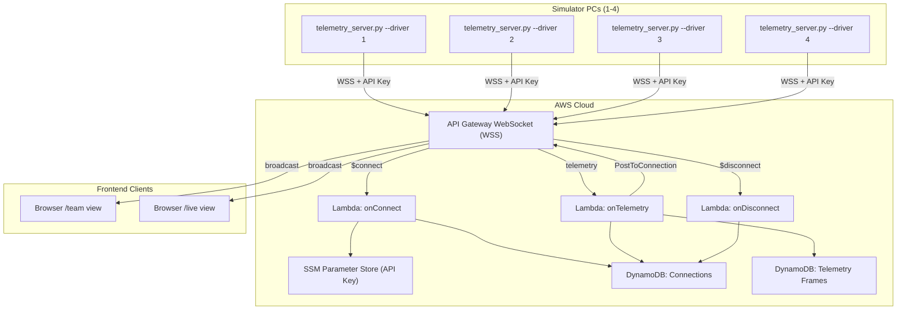
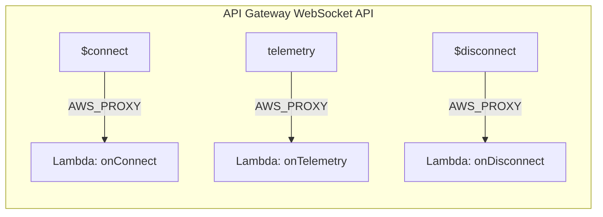
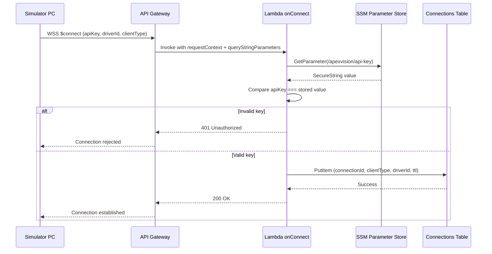
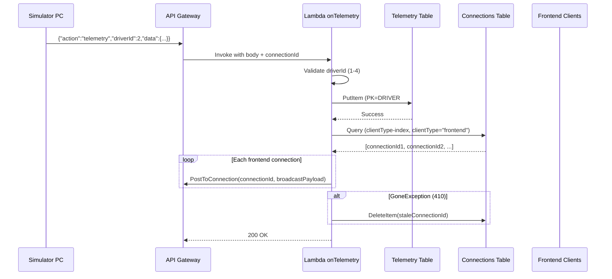
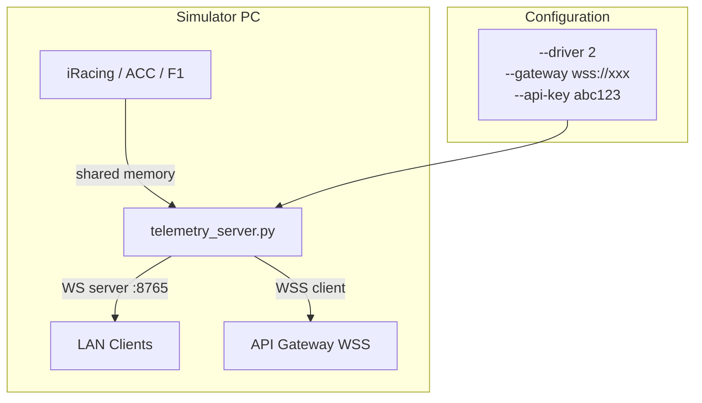
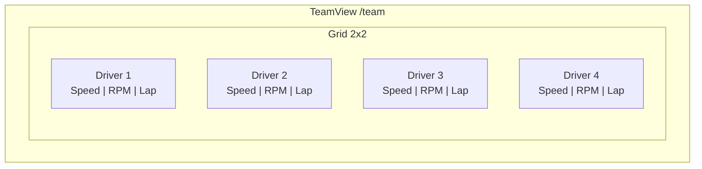
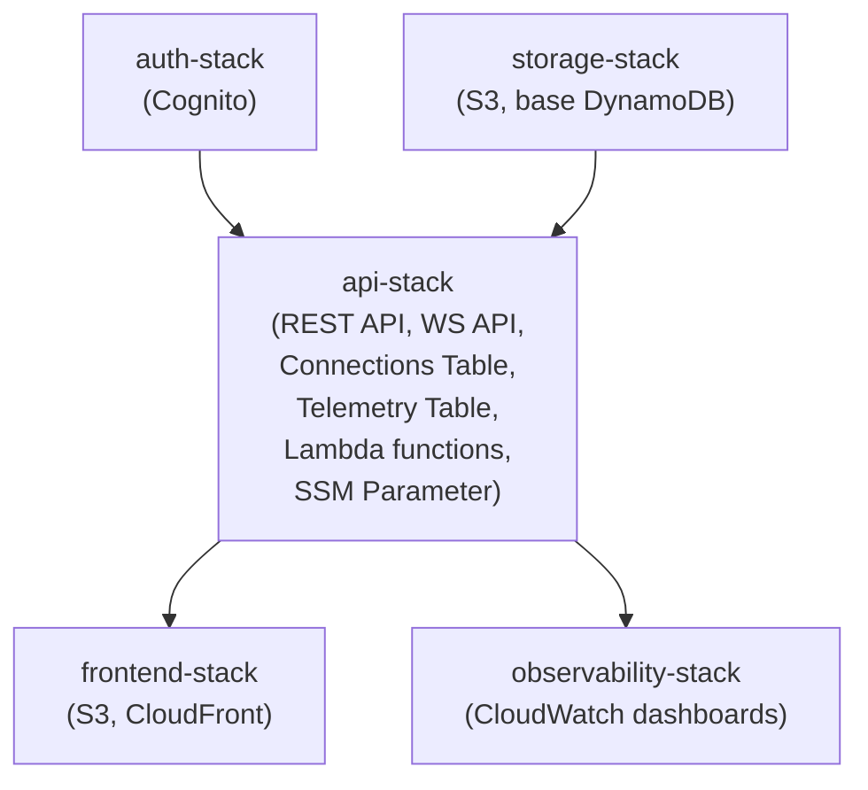
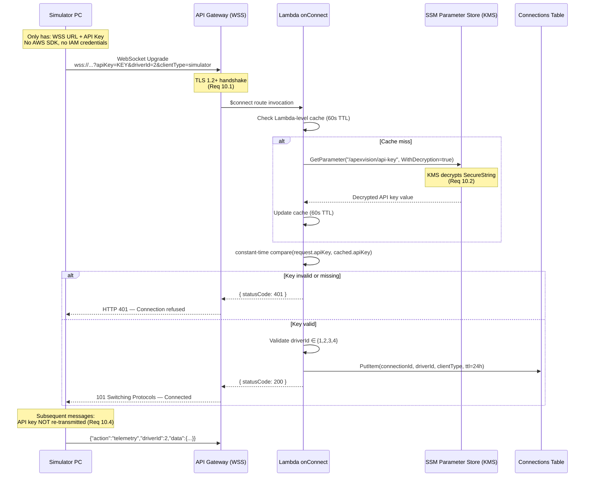

# Technical Design — Secure Multi-Driver Architecture

## Overview

This design describes the implementation of a centralized, secure WebSocket gateway for ApexVision AI that replaces direct AWS credential usage on simulator PCs. The architecture routes telemetry from up to 4 simultaneous simulator PCs through an API Gateway WebSocket endpoint, authenticates via API key, stores frames in DynamoDB, and broadcasts to frontend subscribers in real time.

---

## Architecture



---

## Components and Interfaces

### API Gateway WebSocket API
- **Type:** AWS API Gateway v2 (WebSocket)
- **Protocol:** WSS (TLS 1.2+)
- **Route selection:** `$request.body.action`
- **Routes:** `$connect`, `telemetry`, `$disconnect`
- **Interface:** Accepts connections from simulator PCs and frontend clients

### Lambda Functions
- **onConnect** — Authenticates API key, registers connection
- **onTelemetry** — Stores frame, broadcasts to subscribers
- **onDisconnect** — Cleans up connection records

### DynamoDB Tables
- **Connections Table** — Tracks active WebSocket connections with TTL
- **Telemetry Table** — Stores telemetry frames partitioned by driver

### SSM Parameter Store
- **`/apexvision/api-key`** — KMS-encrypted team API key

### Python Telemetry Script
- **Interface:** WSS client (outbound to gateway) + WS server (local port 8765)

### Frontend React App
- **Interface:** WSS client (subscribes to broadcasts), renders multi-driver views

---

## Data Models

### Connection Record
```typescript
interface ConnectionRecord {
  connectionId: string;    // PK — API Gateway connection ID
  clientType: 'simulator' | 'frontend';
  driverId?: number;       // 1-4 for simulators, null for frontends
  connectedAt: number;     // Unix epoch seconds
  ttl: number;             // Auto-expire at connectedAt + 86400
}
```

### Telemetry Frame Record
```typescript
interface TelemetryFrameRecord {
  driverId: string;        // PK — "DRIVER#1" through "DRIVER#4"
  timestamp: number;       // SK — Unix epoch milliseconds (server-side)
  data: TelemetryPayload;  // Full telemetry frame
  sourceConnectionId: string;
  sessionId?: string;      // For session-index GSI
  ttl: number;             // Auto-expire after 30 days
}
```

### Telemetry Payload (Message Body)
```typescript
interface TelemetryPayload {
  timestamp: number;
  speed: number;
  rpm: number;
  gear: number;
  throttle: number;
  brake: number;
  steering: number;
  lap: number;
  position: number;
  lastLapTime: number;
  bestLapTime: number;
  currentLapTime: number;
  fuelPercent: number;
  gLateral: number;
  gLongitudinal: number;
  tireLF_temp: number;
  tireRF_temp: number;
  tireLR_temp: number;
  tireRR_temp: number;
  handling: 'understeer' | 'oversteer' | 'neutral';
  isOnTrack: boolean;
  trackName: string;
  sessionName: string;
}
```

---

## 1. API Gateway WebSocket Routes

The WebSocket API uses `$request.body.action` as the route selection expression, with three routes handling the full connection lifecycle.



| Route | Integration Type | Lambda | Purpose |
|-------|-----------------|--------|---------|
| `$connect` | AWS_PROXY (Lambda) | `onConnect` | Authenticate API key, register connection |
| `telemetry` | AWS_PROXY (Lambda) | `onTelemetry` | Store frame, broadcast to subscribers |
| `$disconnect` | AWS_PROXY (Lambda) | `onDisconnect` | Clean up connection record |

### Connection URL Format

```
wss://{api-id}.execute-api.us-east-1.amazonaws.com/prod?apiKey={key}&driverId={1-4}&clientType={simulator|frontend}
```

Query parameters on `$connect`:
- `apiKey` (required) — team API key, min 32 chars
- `driverId` (optional) — 1-4, required for simulator clients
- `clientType` (required) — `simulator` or `frontend`

### Stage Configuration

- Stage name: `prod`
- Throttling: 1000 requests/sec burst, 500 steady-state
- Default route settings: logging enabled, data trace enabled
- Message payload max: 32 KB (satisfies Req 5.5)

---

## 2. Lambda Functions

All Lambdas use Node.js 20 runtime, 128 MB memory, 10-second timeout, and are bundled with esbuild.

### 2.1 onConnect Lambda

**Trigger:** `$connect` route  
**Responsibilities:** Validate API key, register connection in DynamoDB



**Input event structure:**
```typescript
interface ConnectEvent {
  requestContext: {
    connectionId: string;
    routeKey: '$connect';
    eventType: 'CONNECT';
    connectedAt: number;
    requestTimeEpoch: number;
  };
  queryStringParameters: {
    apiKey: string;
    driverId?: string;    // "1" | "2" | "3" | "4"
    clientType: string;   // "simulator" | "frontend"
  };
}
```

**Logic:**
1. Extract `apiKey`, `driverId`, `clientType` from `queryStringParameters`
2. If `apiKey` missing → return `{ statusCode: 401 }`
3. Fetch `/apexvision/api-key` from SSM Parameter Store (with caching: 60s TTL in Lambda memory)
4. Compare `apiKey` against stored value
5. If mismatch → return `{ statusCode: 401 }`
6. If `clientType === 'simulator'` and `driverId` not in [1,2,3,4] → return `{ statusCode: 400 }`
7. Write to Connections Table:
   ```json
   {
     "connectionId": "abc123",
     "clientType": "simulator",
     "driverId": 2,
     "connectedAt": 1719500000,
     "ttl": 1719586400
   }
   ```
8. Return `{ statusCode: 200 }`

**SSM Caching Strategy:**
- Cache API key in Lambda global scope
- Refresh every 60 seconds (satisfies Req 2.5 — new key propagates within 60s)
- Use `aws-sdk` `GetParameterCommand` with `WithDecryption: true`

### 2.2 onTelemetry Lambda

**Trigger:** `telemetry` action route  
**Responsibilities:** Validate frame, store in DynamoDB, broadcast to subscribers



**Logic:**
1. Parse `body` JSON, extract `driverId` and `data`
2. If `driverId` not in [1,2,3,4] → return error to sender via `PostToConnection`
3. Add server timestamp: `serverTimestamp = Date.now()`
4. Write to Telemetry Table:
   ```json
   {
     "driverId": "DRIVER#2",
     "timestamp": 1719500000123,
     "data": { "speed": 285.3, "rpm": 12500, ... },
     "ttl": 1721918400
   }
   ```
5. Query Connections Table GSI (`clientType-index`) for all `frontend` connections
6. For each frontend connection, `PostToConnection` with broadcast payload
7. On `GoneException` (410): delete stale connection from Connections Table
8. Return `{ statusCode: 200 }`

**Performance target:** < 100ms per frame (Req 4.3)

### 2.3 onDisconnect Lambda

**Trigger:** `$disconnect` route  
**Responsibilities:** Remove connection record

**Logic:**
1. Extract `connectionId` from `requestContext`
2. Delete item from Connections Table where `connectionId` matches
3. Return `{ statusCode: 200 }`

---

## 3. DynamoDB Table Schemas

### 3.1 Connections Table

**Table name:** `apexvision-{stage}-ws-connections`

| Attribute | Type | Key | Description |
|-----------|------|-----|-------------|
| `connectionId` | String | PK | API Gateway connection ID |
| `clientType` | String | — | `"simulator"` or `"frontend"` |
| `driverId` | Number | — | 1-4 (null for frontends) |
| `connectedAt` | Number | — | Unix epoch (seconds) |
| `ttl` | Number | TTL | Auto-expire after 24 hours |

**Global Secondary Indexes:**

| GSI Name | Partition Key | Sort Key | Projection |
|----------|--------------|----------|------------|
| `clientType-index` | `clientType` (String) | `connectedAt` (Number) | ALL |
| `driverId-index` | `driverId` (Number) | `connectedAt` (Number) | ALL |

**Capacity:** On-demand (PAY_PER_REQUEST)  
**TTL attribute:** `ttl` — connections expire at 24 hours (Req 3.3, 3.4)

### 3.2 Telemetry Table

**Table name:** `apexvision-{stage}-telemetry-frames`

| Attribute | Type | Key | Description |
|-----------|------|-----|-------------|
| `driverId` | String | PK | `"DRIVER#1"` through `"DRIVER#4"` |
| `timestamp` | Number | SK | Unix epoch milliseconds (server-side) |
| `data` | Map | — | Full telemetry frame payload |
| `sourceConnectionId` | String | — | Connection that sent this frame |
| `ttl` | Number | TTL | Auto-expire after 30 days |

**Global Secondary Indexes:**

| GSI Name | Partition Key | Sort Key | Projection |
|----------|--------------|----------|------------|
| `session-index` | `sessionId` (String) | `timestamp` (Number) | ALL |

**Key design rationale:**
- Partition by `driverId` enables efficient per-driver queries (Req 4.5)
- Sort by `timestamp` enables time-range queries for analysis
- `session-index` GSI allows querying all frames in a given session

**Capacity:** On-demand (PAY_PER_REQUEST)  
**TTL attribute:** `ttl` — frames expire after 30 days

---

## 4. Python Script Changes

### Current State (`iracing_live.py`)

The script currently:
1. Reads telemetry from iRacing shared memory at 10 Hz
2. Broadcasts via local WebSocket server on port 8765
3. Writes directly to DynamoDB using `boto3`
4. Uploads session recordings to S3 using `boto3`

### Target State (`telemetry_server.py`)

The script becomes a **dual-mode** client/server:
- **WSS Client** — sends telemetry to API Gateway (cloud path)
- **Local WS Server** — retained on port 8765 (LAN fallback, Req 8.1)



### Key Changes

| Aspect | Before | After |
|--------|--------|-------|
| AWS dependencies | `boto3` (DynamoDB, S3) | None (Req 7.6) |
| Cloud connection | Direct DynamoDB write | WSS client to gateway |
| Authentication | IAM credentials | API key in URL params |
| Local WS | Server on :8765 | Server on :8765 (unchanged) |
| Reconnection | None | Exponential backoff 1s→30s (Req 7.4) |
| Config | Env vars for table/region | CLI args: `--gateway`, `--api-key`, `--driver` |

### Script Architecture

```python
# telemetry_server.py — simplified structure

class TelemetryServer:
    def __init__(self, driver_id: int, gateway_url: str, api_key: str):
        self.driver_id = driver_id
        self.gateway_url = gateway_url
        self.api_key = api_key
        self.gateway_ws = None          # WSS client connection
        self.local_clients = set()      # LAN WS server clients
        self.reconnect_delay = 1.0      # exponential backoff

    async def connect_gateway(self):
        """Connect to API Gateway WSS with API key auth."""
        url = f"{self.gateway_url}?apiKey={self.api_key}&driverId={self.driver_id}&clientType=simulator"
        self.gateway_ws = await websockets.connect(url, ssl=True)
        self.reconnect_delay = 1.0  # reset on success

    async def send_to_gateway(self, frame: dict):
        """Send telemetry frame to gateway."""
        msg = json.dumps({"action": "telemetry", "driverId": self.driver_id, "data": frame})
        await self.gateway_ws.send(msg)

    async def reconnect_loop(self):
        """Exponential backoff reconnection (1s → 30s cap)."""
        while True:
            try:
                await self.connect_gateway()
                await self.gateway_ws.wait_closed()
            except Exception:
                pass
            await asyncio.sleep(self.reconnect_delay)
            self.reconnect_delay = min(self.reconnect_delay * 2, 30.0)

    async def local_ws_handler(self, ws):
        """Handle local LAN WebSocket connections on port 8765."""
        self.local_clients.add(ws)
        try:
            await ws.wait_closed()
        finally:
            self.local_clients.discard(ws)

    async def broadcast_loop(self):
        """Main loop: read telemetry, send to gateway + local clients."""
        while True:
            frame = read_telemetry()  # sim-specific reader
            # Always broadcast locally (Req 8.1)
            for client in self.local_clients.copy():
                await client.send(json.dumps(frame))
            # Send to gateway if connected (non-blocking)
            if self.gateway_ws and self.gateway_ws.open:
                await self.send_to_gateway(frame)
            await asyncio.sleep(1.0 / SAMPLE_RATE_HZ)
```

### CLI Interface

```bash
python telemetry_server.py \
  --driver 2 \
  --gateway wss://abc123.execute-api.us-east-1.amazonaws.com/prod \
  --api-key "your-32-char-minimum-api-key-here" \
  --sim iracing \
  --rate 10
```

### TLS Validation (Req 10.5)

```python
import ssl
ssl_context = ssl.create_default_context()
# connect with ssl=ssl_context
# If TLS handshake fails → log security warning, refuse to send
```

---

## 5. Frontend Changes

### 5.1 New Route: `/team` (4-Driver Grid)

**Component:** `TeamView.tsx`  
**Layout:** 2×2 CSS grid, each cell showing a driver mini-dashboard



**Requirements addressed:** Req 6.1, 6.4, 6.5

**Implementation:**
```typescript
// pages/Team.tsx
export function Team() {
  const { telemetryByDriver, driverStatus } = useTelemetryStore();

  return (
    <div className="grid grid-cols-2 gap-4 p-4 h-screen">
      {[1, 2, 3, 4].map(driverId => (
        <DriverPanel
          key={driverId}
          driverId={driverId}
          telemetry={telemetryByDriver[driverId]}
          isConnected={driverStatus[driverId]?.connected}
        />
      ))}
    </div>
  );
}
```

**Driver availability indicator:**
- Green dot: driver connected and sending telemetry
- Gray dot: driver not connected
- Update within 2 seconds of connect/disconnect (Req 6.4)

### 5.2 Updated Route: `/live` (Driver Selector Dropdown)

**Changes to existing `Live.tsx`:**
- Add a driver selector dropdown at the top
- Filter WebSocket telemetry by selected `driverId`
- Switch displayed data within 200ms (Req 6.3) — client-side filtering, no re-subscription needed

```typescript
// In Live.tsx
const [selectedDriver, setSelectedDriver] = useState<number>(1);
const { telemetryByDriver, driverStatus } = useTelemetryStore();

<select value={selectedDriver} onChange={e => setSelectedDriver(+e.target.value)}>
  {[1, 2, 3, 4].map(id => (
    <option key={id} value={id} disabled={!driverStatus[id]?.connected}>
      Driver {id} {driverStatus[id]?.connected ? '●' : '○'}
    </option>
  ))}
</select>
```

### 5.3 WebSocket Store Updates (`useTelemetryStore`)

The Zustand store manages multi-driver state:

```typescript
interface TelemetryStore {
  telemetryByDriver: Record<number, TelemetryFrame | null>;
  driverStatus: Record<number, { connected: boolean; lastSeen: number }>;
  wsConnection: WebSocket | null;

  connect: (gatewayUrl: string, apiKey: string) => void;
  handleMessage: (msg: BroadcastMessage) => void;
}
```

**Connection URL for frontend:**
```
wss://{api-id}.execute-api.us-east-1.amazonaws.com/prod?apiKey={key}&clientType=frontend
```

### 5.4 Router Update (`App.tsx`)

```typescript
import { Team } from './pages/Team';

// Add to Routes:
<Route path="/team" element={<ProtectedRoute><Team /></ProtectedRoute>} />
```

---

## 6. CDK Stack Structure

### Stack Dependency Graph



### Changes to `api-stack.ts`

The existing `api-stack.ts` already defines the WebSocket API and connections table. Changes:

| Resource | Action | Details |
|----------|--------|---------|
| `WebSocketApi` | Modify | Add route integrations for `$connect`, `telemetry`, `$disconnect` |
| `ConnectionsTable` | Modify | Add `clientType-index` GSI, add `driverId-index` GSI |
| `TelemetryTable` | Add | New table with `driverId` PK, `timestamp` SK, `session-index` GSI |
| `onConnectFn` | Add | Lambda function for `$connect` |
| `onTelemetryFn` | Add | Lambda function for `telemetry` |
| `onDisconnectFn` | Add | Lambda function for `$disconnect` |
| `SSM Parameter` | Add | `/apexvision/api-key` SecureString |
| `WebSocket Stage` | Add | `prod` stage with deployment |
| `IAM Policies` | Add | Lambda → DynamoDB, SSM, API Gateway Management API |

### New Resources in `api-stack.ts`

```typescript
// Telemetry frames table
const telemetryTable = new dynamodb.Table(this, 'TelemetryFramesTable', {
  tableName: `${props.prefix}-telemetry-frames`,
  partitionKey: { name: 'driverId', type: dynamodb.AttributeType.STRING },
  sortKey: { name: 'timestamp', type: dynamodb.AttributeType.NUMBER },
  billingMode: dynamodb.BillingMode.PAY_PER_REQUEST,
  timeToLiveAttribute: 'ttl',
  removalPolicy: cdk.RemovalPolicy.DESTROY,
});

telemetryTable.addGlobalSecondaryIndex({
  indexName: 'session-index',
  partitionKey: { name: 'sessionId', type: dynamodb.AttributeType.STRING },
  sortKey: { name: 'timestamp', type: dynamodb.AttributeType.NUMBER },
  projectionType: dynamodb.ProjectionType.ALL,
});

// SSM Parameter for API key
const apiKeyParam = new ssm.StringParameter(this, 'ApiKeyParam', {
  parameterName: '/apexvision/api-key',
  stringValue: 'PLACEHOLDER-ROTATE-IMMEDIATELY-32CHARS',
  type: ssm.ParameterType.SECURE_STRING,
  tier: ssm.ParameterTier.STANDARD,
});

// Lambda functions (onConnect, onTelemetry, onDisconnect)
// Each with IAM policies for DynamoDB + SSM + API Gateway Management
```

### IAM Policy Summary

| Lambda | DynamoDB | SSM | API GW Mgmt |
|--------|----------|-----|-------------|
| onConnect | PutItem (connections) | GetParameter | — |
| onTelemetry | PutItem (telemetry), Query+Delete (connections) | — | PostToConnection |
| onDisconnect | DeleteItem (connections) | — | — |

---

## 7. Security Flow — API Key Validation



### Security Properties

| Property | Implementation | Requirement |
|----------|---------------|-------------|
| Encryption in transit | WSS (TLS 1.2+) mandatory | Req 10.1 |
| Key at rest | SSM SecureString + KMS | Req 10.2 |
| No hardcoded secrets | IAM role → SSM | Req 10.3 |
| Key only on connect | Query param on `$connect` only | Req 10.4 |
| TLS failure → refuse | Python `ssl.create_default_context()` | Req 10.5 |
| Key rotation | Cache TTL 60s, no redeploy needed | Req 2.5 |
| Constant-time compare | `crypto.timingSafeEqual()` in Lambda | Prevent timing attacks |

---

## 8. Message Formats

### 8.1 Connect Message (Query String)

No message body — authentication is via query string parameters on the WebSocket upgrade request:

```
GET wss://xxx.execute-api.us-east-1.amazonaws.com/prod
    ?apiKey=a1b2c3d4e5f6g7h8i9j0k1l2m3n4o5p6
    &driverId=2
    &clientType=simulator
```

### 8.2 Telemetry Frame (PC → Gateway)

```json
{
  "action": "telemetry",
  "driverId": 2,
  "data": {
    "timestamp": 1719500000.123,
    "speed": 285.3,
    "rpm": 12500,
    "gear": 6,
    "throttle": 98,
    "brake": 0,
    "steering": -2.3,
    "lap": 14,
    "position": 3,
    "lastLapTime": 81.234,
    "bestLapTime": 80.912,
    "currentLapTime": 45.678,
    "fuelPercent": 62.1,
    "gLateral": 1.8,
    "gLongitudinal": -0.3,
    "tireLF_temp": 92.3,
    "tireRF_temp": 94.1,
    "tireLR_temp": 88.7,
    "tireRR_temp": 90.2,
    "handling": "neutral",
    "isOnTrack": true,
    "trackName": "Monza",
    "sessionName": "Race"
  }
}
```

### 8.3 Broadcast Message (Gateway → Frontend)

```json
{
  "type": "telemetry",
  "driverId": 2,
  "serverTimestamp": 1719500000456,
  "data": {
    "timestamp": 1719500000.123,
    "speed": 285.3,
    "rpm": 12500,
    "gear": 6,
    "throttle": 98,
    "brake": 0,
    "steering": -2.3,
    "lap": 14,
    "position": 3,
    "lastLapTime": 81.234,
    "bestLapTime": 80.912,
    "currentLapTime": 45.678,
    "fuelPercent": 62.1,
    "gLateral": 1.8,
    "gLongitudinal": -0.3,
    "tireLF_temp": 92.3,
    "tireRF_temp": 94.1,
    "tireLR_temp": 88.7,
    "tireRR_temp": 90.2,
    "handling": "neutral",
    "isOnTrack": true,
    "trackName": "Monza",
    "sessionName": "Race"
  }
}
```

### 8.4 Connection Status Broadcast (Gateway → Frontend)

Sent when a simulator connects or disconnects, enabling frontend driver availability updates (Req 6.4):

```json
{
  "type": "driverStatus",
  "driverId": 2,
  "status": "connected",
  "serverTimestamp": 1719500000456
}
```

### 8.5 Error Response (Gateway → Sender)

```json
{
  "type": "error",
  "code": "INVALID_DRIVER_ID",
  "message": "driverId must be between 1 and 4",
  "serverTimestamp": 1719500000456
}
```

### Message Size Budget

| Message Type | Typical Size | Max Size |
|-------------|-------------|----------|
| Telemetry frame (PC→GW) | ~1.5 KB | ~8 KB (with carPositions array) |
| Broadcast (GW→FE) | ~1.7 KB | ~8.5 KB |
| Connection status | ~120 bytes | ~200 bytes |
| Error | ~150 bytes | ~300 bytes |

All well within the 32 KB API Gateway payload limit (Req 5.5).

---

## Error Handling

| Scenario | Handler | Action |
|----------|---------|--------|
| Invalid API key on connect | onConnect | Return 401, log attempt |
| Invalid driverId in telemetry | onTelemetry | Send error to sender, discard frame |
| DynamoDB write failure | onTelemetry | Log error, still attempt broadcast |
| Broadcast to stale connection | onTelemetry | Delete connection, continue others |
| SSM unavailable | onConnect | Return 500, CloudWatch alarm |

### Observability

- All Lambdas emit structured JSON logs to CloudWatch
- Custom metrics: `ConnectionCount`, `FramesProcessed`, `BroadcastLatency`
- CloudWatch alarm on error rate > 1%
- X-Ray tracing enabled for latency analysis

### Concurrency

- API Gateway handles concurrent WebSocket connections natively (Req 1.4: 8+ concurrent)
- Lambda concurrent executions: each telemetry frame is independent (Req 5.4)
- DynamoDB on-demand scales automatically with traffic
- No shared mutable state between Lambda invocations

---

## Testing Strategy

- **Unit tests:** Lambda handlers with mocked DynamoDB, SSM, and API Gateway Management SDK
- **Integration tests:** End-to-end WebSocket connect → send → broadcast flow against deployed dev stack
- **Load tests:** 4 simultaneous drivers at 10 Hz (40 messages/sec) verifying < 100ms latency
- **Security tests:** API key validation (valid, invalid, missing, rotated), TLS enforcement
- **Frontend tests:** Component tests for TeamView, Live driver selector, WebSocket store

---

## Correctness Properties

### Property 1: Authentication Completeness
Every connection without a valid API key is rejected with HTTP 401.
**Validates: Requirements 2.1, 2.2**

### Property 2: Connection Tracking Invariant
Every successful `$connect` creates exactly one record in the Connections table; every `$disconnect` removes exactly that record.
**Validates: Requirements 3.1, 3.2**

### Property 3: Broadcast Consistency
Every telemetry frame successfully stored in the Telemetry table is broadcast to all connected frontend subscribers.
**Validates: Requirements 5.1, 5.2**

### Property 4: Driver Isolation
Telemetry frames are partitioned by driverId in DynamoDB and the broadcast payload always includes the correct source driverId.
**Validates: Requirements 4.1, 4.5**

### Property 5: TTL Enforcement
Connection records with TTL < current time are automatically deleted by DynamoDB, preventing stale connection buildup.
**Validates: Requirements 3.3, 3.4**

### Property 6: Reconnection Resilience
Gateway unavailability does not interrupt the local WebSocket server on port 8765 — local clients always receive telemetry.
**Validates: Requirements 7.4, 7.5, 8.1**

### Property 7: Key Rotation Continuity
After an SSM parameter update, the new API key is accepted within 60 seconds without Lambda redeployment.
**Validates: Requirements 2.5**

---

*Design Version: 1.0*  
*References: Requirements Document v1.0, ApexVision Architecture Document v1.0*
